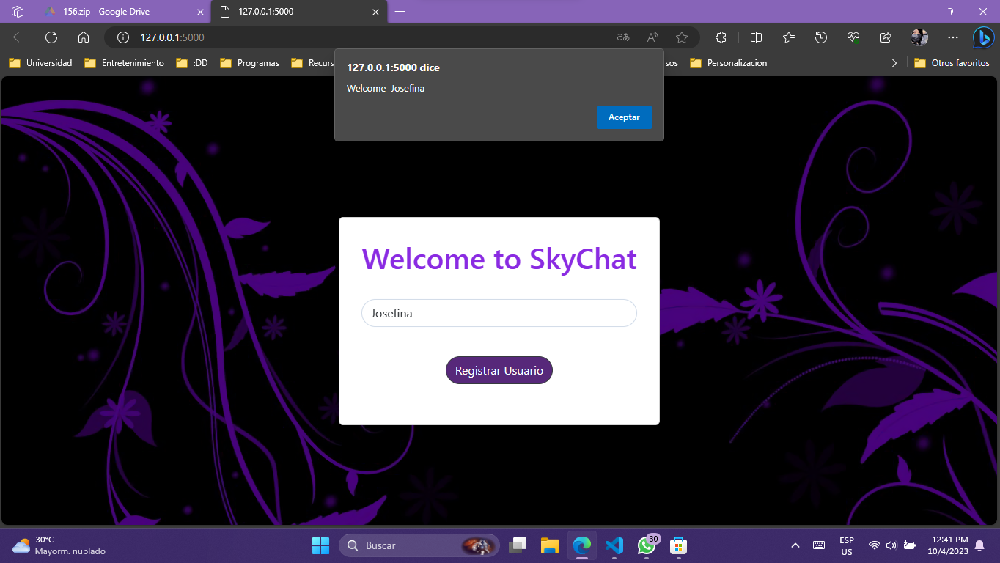
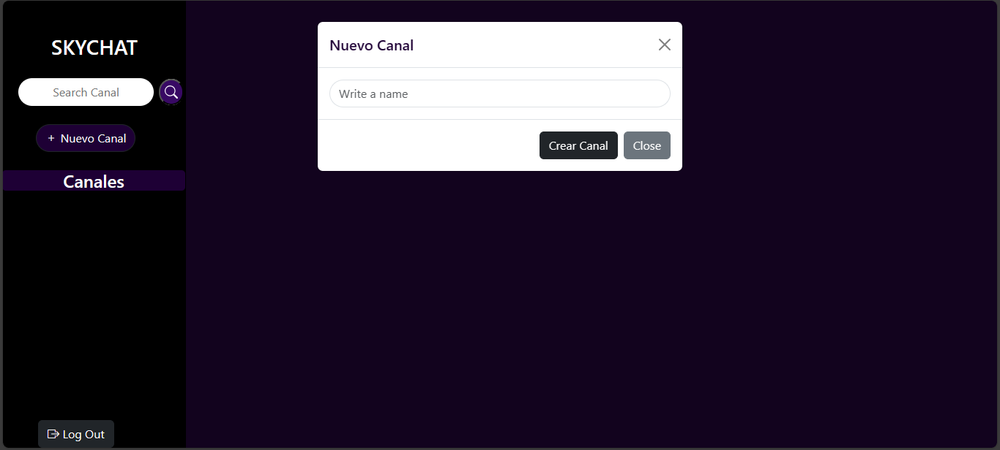
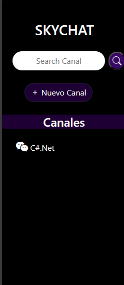
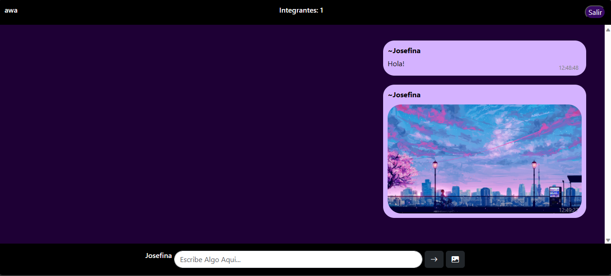
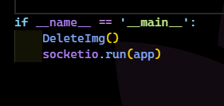

# Project 2

## Para ejecutar 
> Python "application.py"

## Inicio 
Se pide el nombre del usuario, que le permitira interactuar con los demas integrantes.

## Creaccion de Canal
El usuario podra crear canales para interactuar con otros usuarios.

## Lista de Canales 
En la parte izquierda se mostrara la lista de canales creados por usuarios, en donde cada uno,
lo llevara a una sala de chat, tambien podra buscar directamente e ir a la sala de chat ingresando el 
nombre del canal en la barra de busqueda.

## Mensajes
En la sala de chat , esta limitada para recibir solamente 100 mensajes, luego no le dejara enviar mas
tambien se implemento la funcionalidad de envio de imagenes.

## Datos
A como se sabe para el resguardo de mensajes se uso el localstorage y un diccionario 
en la parte del servidor, por lo cual son datos que se borraran cada que se reinicie el servidor
al implementar la funcionalidad de imagenes, no sera necesario manterlas luego que ya no existan 
registros de mensajes en el servidor, por lo cual, se creo un metodo para que cada que se reinicie o
ejecute , se eliminen tambien las mensajes anteriores de la carpeta especificada.

Web Programming with Python and JavaScript
